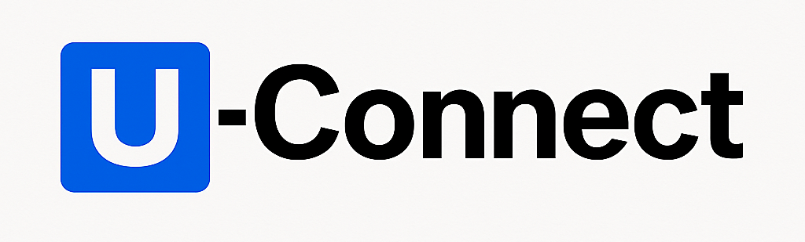

# UConnect 🎓- University Community Platform


[](https://fastapi.tiangolo.com/)
[](https://react.dev/)
[](https://vitejs.dev/)
[](https://tailwindcss.com/)
[](https://www.postgresql.org/)
[](https://huggingface.co/)
[](https://deepmind.google/technologies/gemini/)
[](https://opensource.org/licenses/MIT)


<div align="center">
  
  
  <h2>Connecting Minds, Building Futures.</h2>
  
  <p align="center">
    <b>UConnect</b> is a university-exclusive social media platform, empowering students to share knowledge, collaborate on research, and connect with like-minded peers.
    <br />
    <br />
    <a href="#-team">Quick Start</a>
    ·
    <a href="#-key-features">Features</a>
    ·
    <a href="#-api-documentation">API Documentation</a>
    ·
    <a href="#-development-guidelines">Development Guidelines</a>
    ·
    <a href="https://github.com/Learnathon-By-Geeky-Solutions/noobsquad/issues">Report Bug</a>
    ·
    <a href="https://github.com/Learnathon-By-Geeky-Solutions/noobsquad/issues">Request Feature</a>
  </p>
  
  <div align="center">
    
    
    

   <br />

  <!-- SonarCloud badges -->
  
  
  
  
  </div>

</div>

## 🏫 About UConnect

<table>
<tr>
<td>

**UConnect** brings the university community closer together by offering a dedicated platform for students to share posts, collaborate on educational resources, join field-based communities, and build academic networks.

### Why UConnect?

- 🧠 **Knowledge Sharing**: Share posts, ideas, and academic resources easily
- 🏫 **University-specific Communities**: Connect within your university and department
- 👥 **Field-based Collaboration**: Join and explore communities in your field of interest
- 💬 **Interactive Communication**: Chat, comment, and engage with fellow students
- 📚 **Research Paper Sharing**: Showcase and discover research work among peers
- 📈 **Professional Growth**: Build your academic profile for future opportunities

</td>
</tr>
</table>

### Key Metrics

<div align="center">
  <table>
  <tr>
    <td align="center" width="20%">
      <h3>100% Verified</h3>
      <p>University-Authenticated Users</p>
    </td>
    <td align="center" width="20%">
      <h3>AskU</h3>
      <p>AI-Powered Chatbot Assistant</p>
    </td>
    <td align="center" width="20%">
      <h3>Academic Feed</h3>
      <p>Connect, Share, and Learn</p>
    </td>
    <td align="center" width="20%">
      <h3>Research Hub</h3>
      <p>Collaborate and Publish Work</p>
    </td>
    <td align="center" width="20%">
      <h3>Messenger</h3>
      <p>Instant, Real-Time Messaging</p>
    </td>
  </tr>
</table>

</div>

## 📋 Table of Contents

- [Team](#-team)
- [Project Overview](#-project-overview)
- [Live Demo](#-live-demo)
- [Key Features](#-key-features)
- [System Architecture](#-system-architecture)
- [Database Design](#-database-design)
- [API Documentation](#-api-documentation)
- [Tech Stack](#-tech-stack)
- [Development Guidelines](#-development-guidelines)
- [Testing](#-testing)
- [Resources](#-resources)
- [Contributing](#-contributing)
- [License](#-license)

## 👥 Team

| Role | Name | GitHub |
|------|------|--------|
| **Team Leader** | Raad Shahamat Alif | [](https://github.com/RaadShahamat) |
| **Team Member** | Anish Roy | [](https://github.com/AnishRoy50) |
| **Team Member** | H.M. Fahad | [](https://github.com/hmfahad308) |

## Mentor

- [**shakil-shahan**](https://github.com/shakil-shahan)

## 🚀 Project Overview

UConnect is a university-exclusive social platform designed to promote academic collaboration and social interaction among students. The platform integrates post sharing, research collaboration, **AI-integrated chat support**, community building, and real-time messaging — all under one roof, strictly for verified university students.

### Key Goals

- Connect students within and across universities
- Build vibrant communities based on departments and fields of interest
- Share educational resources and research papers effortlessly
- Stay updated with university events and academic activities
- Experience real-time communication through an integrated chat system
- Get instant support and insights with an AI-powered chatbot

## 🌐 Live Demo

Experience UConnect live:

[](https://u-connect.netlify.app/)

## ✨ Key Features

### For Students 🎓
- **Profile Creation**: Complete multi-step profile (university, department, fields of interest, profile picture)
- **Post Sharing**:General post feed and educational resource feed
- **University & Department Filter**: Browse posts by university and department
- **Friends System**: Add, remove, and interact with friends
- **Messenger System**: Real-time chat with peers
- **Commenting System**: Comment and reply (up to 2 levels depth)
- **Research Collaboration**: Share and explore academic papers
- **Notifications**: Stay updated with latest interactions
- **Events Hub**: Stay updated with university events, workshops, and academic activities

### For Communities 📚
- **University Pages**: Explore posts and events related to specific universities
- **Departmental Pages**: Find and filter departmental content

## 🏛️ System Architecture

> Backend: FastAPI (Python)  
> Frontend: React (Vite) + TailwindCSS  
> Database: PostgreSQL  
> Authentication: JWT-based system  
> Real-time Features: WebSocket (Chat System)

## 🗄️ Database Design

- collaboration_requests
- comments
- connections
- event_attendees
- events
- hashtags
- likes
- messages
- notifications
- post_documents
- post_hashtags
- post_media
- posts
- research_collaborations
- research_collaborators
- research_papers
- shares
- universities
- users

🖼️ Database Design Preview


[🔗 Click here to view the full database design](https://mermaid.live/view#pako:eNq9WFtv2zYU_isEAb9siSE5jpPwYUDWZlixpS2ytBgGAQIt0TY33UZSaT3D_30UKcmSQkWUmk1-sUh-PN85PDfxAIM0JBDB2ewAaEIFAgfgQbEjMfmMGcXriHAP6tEgwpy_pXjLcFyNhZSRQNA0KQY8-ESYoAGOPAiO-jebeUkLmAD5qBGQc8I4OOih4vn-06d3bwENwcdfGoOfbx_e_Hz7oJYnOCaGKRJjGhnGMynmS8pCPXX0kqb4jKUbKvUbZqAGC_G-nPnJyC2hUndOxd4wGZIMMxGTRDQmH-9-fwQbSqKQ--nGp4kgjHBhUkLz9DMaiJwRsy4pF9-kiKITpJJFm-W7-7vfHm_vP4KAESxI6GPRS8CPSUixJQsF6DOn2sjPWdQ7J_ZZvyX8MA3ywt6vwaXaq4dOPX1yzQ6jII2LBfxbyAwenBLhC_J10ulVeEayiFpHRIUaSbYQsp9MVZlHLlFZ5z-yaXW2lZh-byNPI072RVmCioh0TRUSHjCaqQRrspUS74fSXoIaE2OUBviENpH3i9xEA5phe0U00MqeRpFjj2-EvJHnJ1MuwSzYSStkVsVo4kHiNRdMkjHWKCn5lFw6BGPCOd5ahyQnSWjgpuZkpSZFlRqf-3lh_p54TFJBN1R72avYr7lh4-BOTEuTNIZ__PDh17vb94DywrXCKWllw6g0nYT_nRP7UjrJ3JWiXGCR8-lkx1jb7Y-exXN_sOXB8ZOcHNN72Cdio6hR6XZ6ltLCpuWGNmqS-C1L88y6CBdHlL4QTu2O2VxWTARkNxev7fXWmMnqjvKiEbJepbk9MfRHNnMN5P_c0jUkjy23k0jb1NzZDDyQSJeKHc14Na4_BD3oyu_G8_Mfyn_19xkCO8z7Vjrz-XfFYuU-qLTK0Or6FBH4wqj1-ro_toR1rI-0cYZQ3R5pFKzVzSFQvw6T7aY7BPIsSnE4hKs7FKTK4dDydr-AqjI5BOvWZzthVaFERfQnZNiIzYqG1JsdoixMYyDP7W2DLWuDraO3MzkCf6Y0scNUNrBydFOCRHWU2YNNTq_Rmk5fjOmLh0aeeHl5fT1gg2goZLl9U4thSNvlZAurB9b7Op9XBKwSkxKogaVT2uaKmuoQzqhfP6gTIQYNu6EwImYMu5UhYhENNfkhSHU6DeM2J6wjoi3QCv3M2HqDbj58MfmtieRQBDE8g1tGQ4g2OOLkDMaExbh4h6ozKG9-9V1uiNlfHvSSowRJF_kjTWOIBMslTLLb7qqXPCvuH8rr3XqF-jB6k-aJgOhabQDRAX6F6HzlzC-unJtLZ7VYLtyls1ydwT1EN5fzm9XqerlYXrhXruMsjmfwHyXTnTsLx726vlq5l4uLS_dC7ifjXTa99_ryWt1hH_8FaGOuwg)


## 📚 API Documentation

Explore the API using Swagger:

[](https://noobsquad-production.up.railway.app/docs)

## Tech Stack

- **Frontend**: React, Vite, Tailwind CSS
- **Backend**: FastAPI, PostgreSQL, SQLAlchemy, WebSockets
- **Database**: PostgreSQL
- **Authentication**: JWT
- **State Management**: Context API

## 🛠️ Development Guidelines

- Follow [PEP8](https://peps.python.org/pep-0008/) for backend code
- Use [Prettier](https://prettier.io/) for frontend formatting
- Commit messages should follow [Conventional Commits](https://www.conventionalcommits.org/)

## 🧪 Testing

- Backend Unit Tests: pytest
- Frontend Component Tests: vitest, react-testing-library

## 📚 Resources

- [FastAPI Documentation](https://fastapi.tiangolo.com/)
- [React Documentation](https://react.dev/)
- [TailwindCSS Documentation](https://tailwindcss.com/)
- [PostgreSQL Documentation](https://www.postgresql.org/)

## 🤝 Contributing

Contributions are welcome!  
Please check [CONTRIBUTING.md](CONTRIBUTING.md) for guidelines.

## 📄 License

Distributed under the MIT License.  
See [LICENSE](https://github.com/Learnathon-By-Geeky-Solutions/noobsquad/blob/main/LICENSE) for more information.

---


## Getting Started

1. Clone the repository
   ```bash
   git clone https://github.com/noobsquad/uconnect.git
   cd uconnect
   ```
2. Install frontend & backend dependencies
   ```bash
   cd frontend && npm install
   cd ../backend && pip install -r requirements.txt
   ```
3. Setup environment variables (`.env`) in both frontend and backend
4. Start development servers
   ```bash
   # Backend
   uvicorn main:app --reload

   # Frontend (in another terminal)
   npm run dev
   ```

## Development Guidelines

1. Create feature-specific branches
2. Make small, atomic commits
3. Use descriptive commit messages
4. Push changes and create a pull request for code review

## Resources

- 📄 [Project Documentation](docs/)
- ⚙️ [Development Setup](docs/setup.md)
- 🤝 [Contributing Guidelines](CONTRIBUTING.md)

---
Made with 💙 by Team NoobSquad
